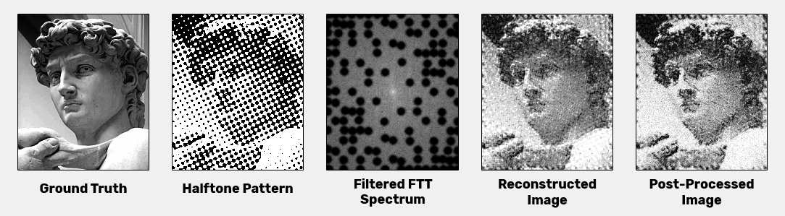
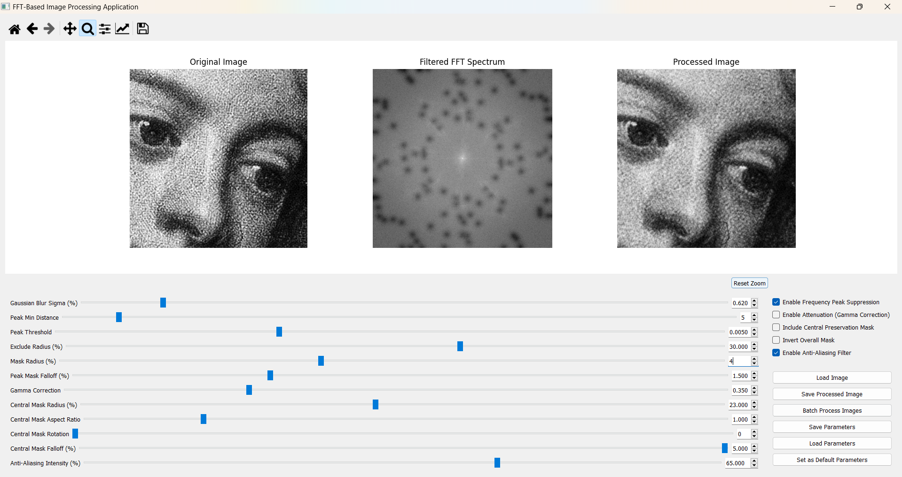

# FFT Pattern Suppression for Image Restoration

**Version:** 2024-09-22

## Overview

FFT Pattern Suppression is a tool designed to automatically detect and remove unwanted periodic patterns from images, such as:

- **Halftone Dots:** Repetitive grid-like patterns from printing techniques.
- **Paper Textures:** Tiny embossed or debossed circles from photographic paper.
- **Offset Printing Patterns:** Halftone dots arranged in a grid in color images.

The application restores clarity and fidelity to images by suppressing these patterns by leveraging Fast Fourier Transform (FFT) filtering techniques.

## Examples

### Halftone Pattern Example

### Application Screenshot

### [Other Examples](examples/)

## Features

- **Automatic Detection and Removal:** Utilizes FFT to detect and suppress unwanted frequency components.
- **Real-Time Visualization:** Interactive filtering with immediate visual feedback.
- **Parameter Management:** Save, load, and set default filter settings.
- **Batch Processing:** Efficiently process large collections of images.
- **GPU Acceleration (Optional):** Leverages GPU via CuPy and CUDA for high-performance processing on systems with NVIDIA GPUs.

## Target Audience

- Restoration experts and archivists
- Photographers and designers
- Printing and publishing professionals
- Researchers and historians

## Installation

Please refer to the [Installation Guide](INSTALLATION.md) for installation instructions.

## Usage

1. **Load an Image:** Click on "Load Image" and select the image you want to process.
2. **Adjust Parameters:** Use the sliders and checkboxes to fine-tune the filtering process.
3. **Real-Time Feedback:** View the original image, FFT spectrum, and processed image side by side.
4. **Save the Processed Image:** Click on "Save Processed Image" to save your results.

## Performance Note

- **With CUDA and CuPy:** The application utilizes GPU acceleration for faster processing.
- **Without CUDA and CuPy:** The application will run using CPU only, and performance may be degraded, especially with large images.

## License

This project is licensed under the **GNU Affero General Public License v3.0 (AGPL-3.0)**. See the [LICENSE](LICENSE.md) file for details.

### AGPL-3.0 Summary:

- You can use, modify, and distribute this software freely.
- If you distribute the software or a modified version, you must:
  - Provide the complete source code.
  - License your modifications under the same AGPL-3.0 terms.
  - Preserve the original copyright notices.
- If you run a modified version of the software on a server and allow users to interact with it remotely, you must also make the source code of your modified version available to those users.
- There's no warranty for the software.

This summary is not a substitute for the full license. Always refer to the complete [LICENSE](LICENSE.md) for legal details.

## Contributing

Contributions are welcome! Please read the [Contributing Guidelines](CONTRIBUTING.md) before submitting pull requests.

## Disclaimer

This project is a personal learning exercise. While user feedback is invaluable, please note that thorough support or continuous development beyond the current scope may not be provided.